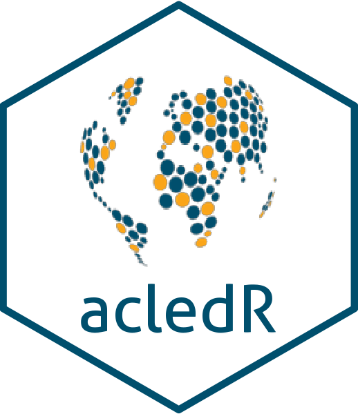

<!-- README.md is generated from README.Rmd. Please edit that file -->

```{r, echo = FALSE}
knitr::opts_chunk$set(
  collapse = TRUE,
  comment = "#>",
  fig.path = "man/figures/"
)
```


# acledR <a href='billingtt.github.io/acledR/'></a>

<!-- badges: start -->
[](https://github.com/billingtt/acledR/actions/workflows/lucas_flow.yaml)

<!-- badges: end -->


# Overview

This package provides tools to extract and manipulate data from the [Armed Conflict Location and Event Data Project (ACLED)](https://acleddata.com/). 

To access ACLED data, please register an account at [developer.acleddata.com](developer.acleddata.com). 

* You can visit our [guide](https://acleddata.com/acleddatanew//wp-content/uploads/2021/11/ACLED_Access-Guide_October-2020.pdf) on how to easily set up your ACLED account. 
* We recommend you to save your ACLED API Key in an R object so you can easily re-use your key. 

## Installation (for private repo)

Since the package repo is currently private, you need to tell R and Github that you're a collaborator. To do so, you first create a Github personal access token (PAT). You can set this to expire after a certain time (the default) or be permanent. We can initiate this process internally via:

```{r, eval=F}
# install.packages("usethis") if not installed already
# create personal access token - this should redirect to your github page where you can copy the token
usethis::create_github_token()
```

After you've copied the PAT from the browser, return to R and run this, which will store the PAT locally.

```{r, eval=F}
# paste the token where it says YourPAT
credentials::set_github_pat("YourPAT")
# if you run this, it should print your token; if not we've failed
Sys.getenv("GITHUB_PAT")
```

I recommend also setting the PAT in your `.Rprofile` so it's stored for all R sessions (i.e., you don't have to save the PAT and paste it in each time you re-install).

```{r, eval=F}
# to set your PAT for all R sessions, run
file.edit(file.path("~", ".Rprofile"))
# and then paste credentials::set_github_pat("YourPAT") into the .Rprofile script
# save the file
```

Now you can install the package and it will automatically locate your PAT.

```{r, eval=F}
# install from github
devtools::install_github("billingtt/acledR")
```


## Installation (for public use) 

Until the acledR package gets added into the Comprehensive R Archive Network (CRAN), users can utilize devtools to install the package from Github. Thankfully, the installation is rather simple. You can install it through the following code:

```{r, eval = F}
devtools::install_github("billingtt/acledR") ## if you are interested in a particular branch, please add a 'ref' argument. 
```
